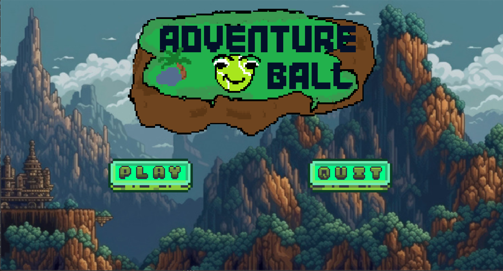
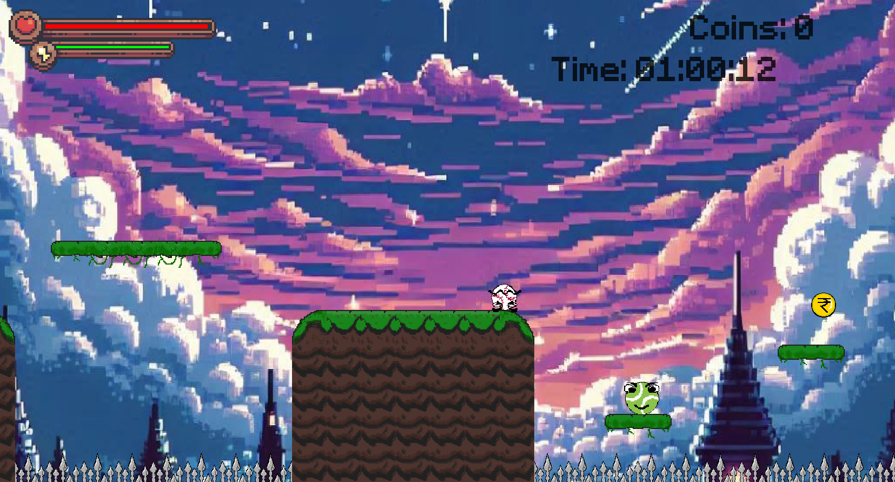
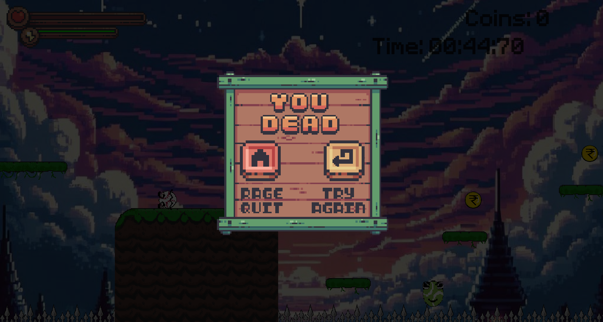

# Adventure Ball Game 🎮

A 2D side-scrolling platformer built in Java with a custom game engine - featuring combat, collectibles, enemies, audio, a scoring system, and multi-level progression.







---

## Table of Contents

- [About the Game](#about-the-game)
- [Gameplay](#gameplay)
- [Features](#features)
- [Controls](#controls)
- [Project Structure](#project-structure)
- [Architecture Overview](#architecture-overview)
- [Getting Started](#getting-started)
- [Technical Highlights](#technical-highlights)

---

## About the Game

Adventure Ball Game is a handcrafted 2D platformer written entirely in Java (SE 22), using only the standard library and `javax.sound.sampled` for audio - no game engine frameworks. The game features a custom game loop, sprite-based animation, tile-based level rendering, hitbox collision detection, an enemy behavior system system, a coin/spike object system, and a persistent high-score tracker.

---

## Gameplay

Navigate through multiple levels, defeat enemies, collect coins, and reach the end before time runs out. Your score is calculated from coins collected and time remaining. High scores are saved between sessions.

- Beat all levels to complete the game and see your final score
- Each level has a 2-minute timer - run out of time or health and it's game over
- Enemies patrol and attack when they spot you - fight back or dash through

---

## Features

- **Custom Java Game Engine** - fixed-timestep game loop running at 200 UPS / 120 FPS
- **Tile-based Level System** - levels are encoded as PNG images; pixel color channels encode tile type, enemies, coins, spikes, and player spawn
- **Player Mechanics** - run, jump, attack, and dash with cooldown management
- **Enemy Behavior System (Bablu)** - line-of-sight detection, patrol, chase, and attack states
- **Object System** - hovering coins with hitbox detection, spike hazards
- **Audio System** - background music per level, sound effects for jump/attack/death/level-complete, volume control and mute toggles
- **UI Overlays** - pause menu, game over screen, level completed screen, game completed screen
- **Score System** - per-level and all-time high scores, persisted to `scores.txt`
- **Resolution Scaling** - auto-scales to any screen size using a computed `SCALE` factor
- **Hitbox Debug Mode** - toggle rendering of hitboxes for testing

---

## Controls

| Action | Keys |
|---|---|
| Move Left | `A` / `←` |
| Move Right | `D` / `→` |
| Jump | `W` / `↑` / `Space` |
| Attack | Left Mouse Click |
| Dash | `Shift` (hold while moving) |
| Pause | `P` / `Esc` |
| Back to Menu | `Backspace` |

---

## Project Structure

```
Adventure_Ball_Game/
├── src/
│   ├── audio/
│   │   └── AudioPlayer.java          # Music + SFX management
│   ├── entities/
│   │   ├── Entity.java               # Base entity with hitbox, animation state
│   │   ├── Player.java               # Player movement, combat, dash, HUD
│   │   ├── Enemy.java                # Base enemy behavior system (patrol, chase, attack)
│   │   ├── Bablu.java                # Concrete enemy type
│   │   └── EnemyManager.java         # Manages all enemies per level
│   ├── gamestates/
│   │   ├── GameState.java            # State enum (MENU, PLAYING, OPTIONS, QUIT)
│   │   ├── Playing.java              # Core gameplay loop state
│   │   ├── Menu.java                 # Main menu
│   │   ├── GameOptions.java          # Options/settings screen
│   │   ├── State.java                # Base state class
│   │   └── StateMethods.java         # Interface for all states
│   ├── inputs/
│   │   ├── KeyboardInputs.java       # Keyboard event routing
│   │   └── MouseInputs.java          # Mouse event routing
│   ├── levels/
│   │   ├── Level.java                # Level data, timing, coins collected
│   │   └── LevelManager.java         # Loads/renders all levels, manages progression
│   ├── main/
│   │   ├── Game.java                 # Root class: game loop, scale constants
│   │   ├── GamePanel.java            # JPanel render target
│   │   ├── GameWindow.java           # JFrame window setup
│   │   └── MainClass.java            # Entry point
│   ├── object/
│   │   ├── GameObject.java           # Base for interactive objects
│   │   ├── Coin.java                 # Collectible coin with hover animation
│   │   ├── Spike.java                # Hazard spike
│   │   └── ObjectManager.java        # Manages all objects per level
│   └── ui/
│       ├── AudioOptions.java         # Volume slider + mute buttons
│       ├── GameCompletedOverlay.java  # End-of-game screen with score
│       ├── GameOverOverlay.java       # Death screen
│       ├── LevelCompletedOverlay.java # Per-level completion + score
│       ├── PauseOverlay.java         # Pause menu
│       ├── MenuButton.java           # Animated menu button
│       ├── URMButton.java            # Undo/Replay/Menu icon button
│       ├── SoundButtons.java         # Music/SFX mute toggle
│       ├── VolumeButton.java         # Volume slider
│       └── PauseButton.java          # Base button class
└── utilities/
    ├── Constants.java                # Game-wide constants (gravity, damage, animation speeds)
    ├── HelpMethods.java              # Collision detection, level data parsing, score calculation
    └── LoadSave.java                 # Asset loading, font loading, score file I/O
```

---

## Architecture Overview

### Game Loop

The game runs a decoupled fixed-timestep loop in `Game.java`:

- **200 UPS** (updates per second) for physics/logic
- **120 FPS** (frames per second) for rendering
- Delta-time accumulation ensures consistent simulation speed regardless of hardware

### Level Encoding

Levels are stored as PNG images in `/resources/lvls/`. Each pixel encodes game data via color channels:

| Channel | Data |
|---|---|
| Red | Tile type (0–8 = empty/passable, others = solid) |
| Green | Entity spawn (0 = Bablu enemy, 48 = player spawn) |
| Blue | Object spawn (4 = spike, 30 = coin) |

This approach means level design happens in any image editor - no custom tooling required.

### State Machine

`GameState` drives which system receives input and renders each frame:

```
MENU → PLAYING → (PAUSED / GAME OVER / LEVEL COMPLETED / GAME COMPLETED)
     ↘ OPTIONS
```

### Collision Detection

All collision uses `Rectangle2D.Float` hitboxes. `HelpMethods` provides:

- `CanMoveHere()` - checks four corners against tile solidity
- `IsSightClear()` - raycasts horizontally along a tile row for enemy line-of-sight
- `IsEntityOnFloor()` - checks one pixel below the entity

### Score Calculation

```java
score = ((coins * 100) / 5) + ((timeRemaining * 3) / 583)
```

Scores are persisted per level and for the overall run in `scores.txt`.

---

## Getting Started

### Prerequisites

- Java SE 22+
- Eclipse IDE (or any Java IDE supporting the `.classpath` format)

### Running the Project

1. Clone the repository
2. Open in Eclipse as an existing project
3. Ensure `/resources/` is on the classpath (already configured in `.classpath`)
4. Place `minecraft_font.ttf` and `scores.txt` in the project root
5. Run `main.MainClass` (preferably using Eclipse IDE)

### Resource Layout

```
resources/
├── audio/          # .wav files for music and effects
├── backgrounds/    # Background images per level
├── lvls/           # Level PNG files (lvl1_data.png, lvl2_data.png, ...)
├── MenusAndBars/   # UI sprite sheets
├── objectNcoin/    # Coin and spike sprites
└── sprites/        # Player and enemy sprite sheets
```

---

## Technical Highlights

- **No external game framework** - pure Java with `javax.swing` + `java.awt` + `javax.sound.sampled`
- **PNG-as-level-data** pattern for compact, editor-friendly level design
- **Auto-scaling resolution** - adapts to any display via computed `SCALE` constant at startup
- **Sprite sheet animation** - frame-indexed subimage extraction with per-state frame counts
- **Shutdown hook** for score persistence - scores write to disk even on abrupt exit
- **Enemy reverse-animation** - running-reverse frames derived at runtime by reversing the run sequence, halving sprite sheet size